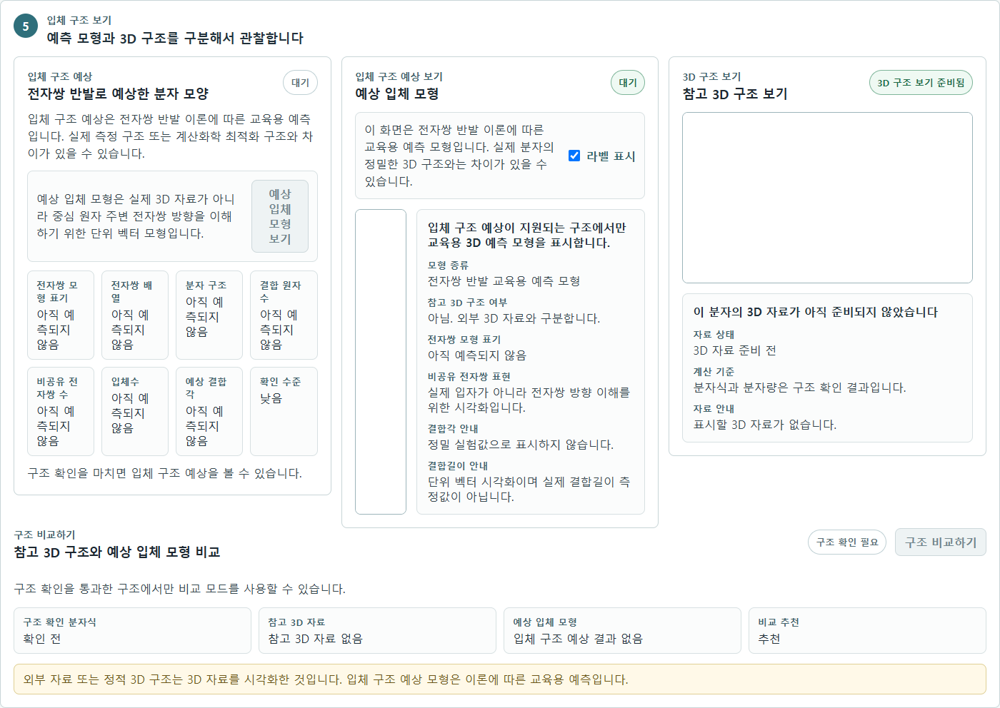
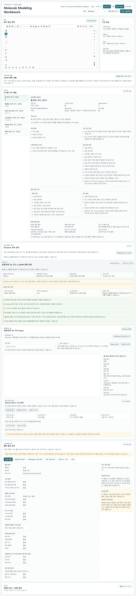

# 다양한 분자의 분자구조 모델링

[](https://github.com/musicofcity-kr/molecular-modeling-program/actions/workflows/ci.yml)

고등학교 화학 수업에서 분자 구조를 그리고 확인하는 교육용 웹앱입니다.

이 프로젝트는 분자 선택, 구조 입력, 검증, 3D 관찰을 한 작업 화면에서 바로 사용할 수 있도록 제공하는 것을 목표로 합니다.

<!-- TODO: 배포 URL -->

| 입체 구조 보기 | 교사용 안내 |
|---|---|
|  |  |

## 현재 상태

- React + Vite + TypeScript 기반 웹앱
- Ketcher 기반 2D 분자 구조 입력
- RDKit.js 기반 구조 확인, 분자식, 평균 분자량 계산
- 3Dmol.js 기반 3D 구조 시각화
- 정적 3D 예제와 PubChem 기반 외부 3D 자료 불러오기
- 단계 잠금 없이 바로 사용하는 학생용 분자 모델링 작업 화면
- 예상 입체 모형 아래 학생 생각 정리와 교사 제출 기능
- 윤리 가이드 게이트, 개인정보처리방침, 이용약관 화면 포함
- Firebase Auth/Firestore 기반 수업방, 학생 제출, 교사 피드백 반환 흐름
- 교사용 AI 피드백 초안 생성 API 연결

## 기술 스택

| 영역 | 사용 기술 | 현재 버전 기준 |
|---|---|---|
| 프론트엔드 | React, Vite, TypeScript | React 19.1 / Vite 6.3 / TypeScript 5.8 |
| 2D 분자 편집 | Ketcher | 3.15 |
| 구조 확인 | RDKit.js | 2025.3 |
| 3D 시각화 | 3Dmol.js | 2.5 |
| 인증/저장 | Firebase Web SDK / Firebase Admin SDK | Firebase 12.15 / Admin 13.5 |
| 테스트 | Vitest | 3.2 |

## 앱 위치

실제 실행 앱은 다음 위치에 있습니다.

```text
apps/workbench
```

## 로컬 실행

```powershell
cd apps/workbench
npm install
npm run dev
```

기본 로컬 주소:

```text
http://127.0.0.1:5173/
```

## 검증 명령

```powershell
cd apps/workbench
npm run typecheck
npm test
npm run build
npm run test:e2e
```

`npm run test:e2e`는 Playwright 기반 UI 흐름 검증입니다. 학생/교사
수업 흐름의 화면 무결성을 확인하며, Firebase/Vercel 서버 API는 테스트
내부 mock 응답으로 경계를 고정합니다. RDKit.js 구조 확인은 mock하지 않고
물 예제의 실제 분자식과 평균 분자량을 확인합니다.

## 학생 사용 흐름

1. 윤리 가이드와 약관을 확인한 뒤 시작합니다.
2. `학생 활동`에서 교사가 안내한 수업코드, 입장 확인코드, 수업용 이름을 입력합니다.
3. 작업할 분자를 선택합니다. 서버 수업방에 활동 템플릿이 지정된 경우 지정된 분자만 표시됩니다.
4. 분자 예시를 불러오거나 편집기에서 직접 구조를 그립니다.
5. `내 구조 확인하기`로 RDKit.js 검증값인 분자식과 평균 분자량을 확인합니다.
6. 검증된 구조의 참고 3D 자료와 VSEPR 모형을 확인합니다.
7. `나의 생각 정리`에 예상 입체 모형을 보고 정리한 내용을 작성합니다.
8. `교사에게 제출하기`로 교사 제출함에 보냅니다.

별도 예측 단계, 여러 성찰 문항, 이전/다음 단계 이동, 단계 잠금, 결과 보고서 패널은 학생 기본 작업 화면에 포함하지 않습니다. 생각 정리와 제출은 예상 입체 모형 아래 한 곳에서만 수행합니다.

## 교사 사용 흐름

1. `교사용 안내`에서 Firebase Auth 기반 Google 또는 이메일 로그인으로 입장합니다.
2. 교사 계정에는 Firebase Admin SDK로 `teacher: true` custom claim이 부여되어 있어야 합니다.
3. Firebase 로그인이 어려운 수업 현장에서는 `VITE_EMERGENCY_TEACHER_USERNAME`, `VITE_EMERGENCY_TEACHER_PASSWORD`가 설정된 배포본에서만 긴급 교사용 보기로 임시 진입할 수 있습니다.
4. 긴급 로그인 값은 공개 저장소에 커밋하지 않습니다. 이 값은 브라우저 번들에 노출될 수 있으므로 실제 계정 비밀번호를 재사용하지 않습니다.
5. 긴급 로그인은 Firebase ID token을 만들지 않으므로 서버 제출 조회, 수업방 생성, 피드백 반환 같은 Firestore 기능 권한으로 사용하지 않습니다.
6. 수업명, 수업코드, 학생 입장 확인코드, 사용할 활동 템플릿을 정해 수업방을 만듭니다.
7. 학생에게 수업코드와 입장 확인코드를 안내합니다.
8. `서버 제출 목록 불러오기`로 학생 제출 자료를 확인합니다.
9. 제출 자료를 선택해 `AI 피드백 초안 만들기`를 실행합니다.
10. 초안을 교사가 검토하고 수정한 뒤 `교사 확인 후 학생에게 전달`로 반환합니다.

AI 피드백은 자동 채점이 아닙니다. 학생에게 전달하기 전 교사가 과학 내용,
표현, 개인정보 포함 여부를 반드시 확인해야 합니다.

학생 제출은 구조 검증, 생각 작성, Firebase 수업방 입장이 모두 완료된 경우에만
활성화됩니다. 교사는 제출 목록에서 학생 생각을 확인할 수 있습니다.

## Vercel 배포 설정

GitHub 저장소를 Vercel에 연결할 때 다음 값을 사용합니다.

```text
Framework Preset: Vite
Root Directory: apps/workbench
Install Command: npm install
Build Command: npm run build
Output Directory: dist
```

자세한 배포 절차는 [docs/VERCEL_FIREBASE_DEPLOYMENT_RUNBOOK.md](docs/VERCEL_FIREBASE_DEPLOYMENT_RUNBOOK.md)를 참고합니다.

## 환경 변수

환경 변수 예시는 [apps/workbench/.env.example](apps/workbench/.env.example)에 있습니다.

주의:

- Gemini 같은 AI provider API key를 브라우저용 `VITE_*` 변수에 넣지 않습니다.
- AI 피드백은 `/api/create-feedback-draft` Vercel Function에서 서버 측으로 처리합니다.
- 별도 AI 프록시 서버를 쓰려면 `AI_FEEDBACK_ENDPOINT`를 등록합니다.
- 내장 Gemini 호출을 쓰려면 Vercel Environment Variables에 `GEMINI_API_KEY`, `GEMINI_MODEL`, `GEMINI_BASE_URL`을 등록합니다.
- Firebase service account, private token은 공개 저장소에 커밋하지 않습니다.

권장 AI 환경변수:

```text
GEMINI_API_KEY=...
GEMINI_MODEL=gemini-3.1-flash-lite
GEMINI_BASE_URL=https://generativelanguage.googleapis.com/v1beta
VITE_EMERGENCY_TEACHER_USERNAME=
VITE_EMERGENCY_TEACHER_PASSWORD=
```

AI API 키가 없거나 호출이 실패하면 앱은 로컬 가드레일 기반 교사용 피드백 초안을 생성합니다.

## 사용자 이용 매뉴얼

상세 매뉴얼 원본은 [docs/MOLECULE_MODELING_WORKBENCH_USER_MANUAL.md](docs/MOLECULE_MODELING_WORKBENCH_USER_MANUAL.md)에 있으며, 아래 내용은 GitHub README에서 바로 확인할 수 있는 핵심 사용 절차입니다.


### 1. 프로그램 목적

`다양한 분자의 분자구조 모델링`은 고등학교 화학 수업에서 학생이 2D 분자 구조를 그리고, 검증된 분자식/평균 분자량과 3D 시각화 자료를 구분해 확인하도록 돕는 교육용 웹앱입니다.

이 앱은 분자 구조 입력, 구조 확인, 3D 관찰을 불필요한 교육 단계 없이 바로 사용할 수 있도록 제공하는 것이 목표입니다.

### 2. 화면 구성

| 영역 | 용도 |
|---|---|
| 윤리/약관 게이트 | 핵심 가이드, 개인정보처리방침, 이용약관 확인 후 시작 |
| 학생 활동 화면 | 수업코드 입력 후 분자 선택, 구조 편집, 검증, 구조 보기 |
| 분자 편집 영역 | Ketcher 기반 2D 분자 구조 입력 |
| 구조 확인 결과 | RDKit.js 검증 기반 분자식, 평균 분자량 표시 |
| 참고 3D 구조 | 정적 좌표 또는 PubChem SDF 기반 3Dmol.js 시각화 |
| 입체 구조 예상 | VSEPR 기반 교육용 예측 모형 |
| 교사용 안내 | 수업방 생성, 제출 목록 조회, AI 피드백 초안 작성, 피드백 반환 |

### 3. 학생 사용 방법

1. 앱 첫 화면에서 윤리 가이드와 약관을 확인하고 시작합니다.
2. `학생 활동`에서 교사가 안내한 `수업코드`, `학생 입장 확인코드`, `수업용 이름`을 입력합니다.
3. 작업할 분자를 선택합니다. 교사가 서버 수업방에 활동을 제한한 경우 지정된 분자만 표시됩니다.
4. 분자 예시를 불러오거나 직접 구조를 그립니다.
5. `내 구조 확인하기`를 눌러 검증된 분자식과 평균 분자량을 확인합니다.
6. 참고 3D 구조와 VSEPR 모형을 확인합니다.

학생 기본 화면은 예측·성찰·보고서 입력을 요구하지 않으며 모든 핵심 도구를 한 화면에 표시합니다.

학생 화면에서는 기본적으로 `SMILES`, `MOL`, `PubChem CID`, `JSON`, 개발자 로그 같은 기술 용어를 노출하지 않습니다.

### 4. 교사 사용 방법

1. `교사용 안내`에서 Firebase Auth 기반 Google 또는 이메일 로그인으로 입장합니다.
2. 교사 계정에는 Firebase Admin SDK로 `teacher: true` custom claim이 부여되어 있어야 합니다.
3. Firebase 로그인이 어려운 수업 현장에서는 `VITE_EMERGENCY_TEACHER_USERNAME`, `VITE_EMERGENCY_TEACHER_PASSWORD`가 설정된 배포본에서만 긴급 교사용 보기로 임시 진입할 수 있습니다.
4. 긴급 로그인 값은 공개 저장소에 커밋하지 않습니다. 이 값은 브라우저 번들에 노출될 수 있으므로 실제 계정 비밀번호를 재사용하지 않습니다.
5. 긴급 로그인은 Firebase ID token을 만들지 않으므로 서버 제출 조회, 수업방 생성, 피드백 반환 같은 Firestore 기능 권한으로 사용하지 않습니다.
6. 수업명, 수업코드, 학생 입장 확인코드, 사용할 활동 템플릿을 선택해 수업방을 만듭니다.
7. 학생에게 수업코드와 입장 확인코드를 안내합니다.
8. `서버 제출 목록 불러오기`로 학생 제출 자료를 확인합니다.
9. 제출 자료를 선택하고 `AI 피드백 초안 만들기`를 실행합니다.
10. AI 또는 로컬 가드레일 기반 피드백 초안을 교사가 검토하고 수정합니다.
11. `교사 확인 후 학생에게 전달`을 눌러 학생에게 피드백을 반환합니다.

AI 피드백은 자동 채점이 아닙니다. 학생에게 전달하기 전 교사가 과학 내용, 표현, 개인정보 포함 여부를 반드시 확인해야 합니다.

### 5. 핵심 기능별 사용법

| 기능 | 사용 방법 | 주의 |
|---|---|---|
| 예제 분자 불러오기 | 예제 목록에서 물, 메테인, 암모니아, 이산화탄소, 에탄올, 벤젠 등을 선택 | 예제 데이터도 RDKit.js 검증 흐름을 통과한 값만 결과로 표시 |
| 직접 그리기 | Ketcher 편집기에서 원자, 결합, 고리 도구로 구조 작성 | 빈 구조나 원자가 오류가 있으면 결과값을 표시하지 않음 |
| 구조 확인 | `내 구조 확인하기` 클릭 | 분자식과 평균 분자량은 RDKit.js 결과 기준 |
| 참고 3D 구조 | 정적 3D 좌표 또는 PubChem 3D SDF를 3Dmol.js로 표시 | 3D 구조는 시각화 자료이며 분자식/분자량 기준이 아님 |
| 입체 구조 예상 | VSEPR 교육용 예측 모형 표시 | 실제 측정 구조나 계산화학 최적화 구조가 아님 |
| 활동 결과 제출 | `교사에게 제출하기` 클릭 | 서버 연결 실패 시 브라우저 제출함 fallback 유지 |
| AI 피드백 | 교사가 제출 자료를 선택해 초안 생성 | 교사 검토 후에만 학생에게 전달 |

### 6. 과학 정확성 원칙

- 검증되지 않은 구조에서 분자식과 평균 분자량을 확정값처럼 표시하지 않습니다.
- 분자식과 평균 분자량은 RDKit.js 검증 결과를 기준으로 합니다.
- PubChem 3D 구조는 외부 좌표 시각화 자료이며 RDKit.js 검증값을 대체하지 않습니다.
- VSEPR 모형은 이상화된 교육용 예측이며 실제 실험 구조가 아닙니다.
- 결합각, 결합길이, 에너지 최소화, 양자화학 계산 결과처럼 오해될 수 있는 표현은 피합니다.

### 7. AI 피드백 운영 원칙

- AI 피드백은 형성 피드백 초안입니다.
- 자동 채점, 점수, 등급 산출 기능이 아닙니다.
- 학생의 성취도, 인성, 태도를 단정하지 않습니다.
- 학생 실명, 학번, 전화번호, 이메일 같은 민감정보를 피드백 요청 payload에 넣지 않습니다.
- AI API key는 브라우저 코드나 `VITE_*` 환경변수에 넣지 않습니다.
- `GEMINI_API_KEY` 또는 `AI_FEEDBACK_ENDPOINT`는 Vercel 서버 환경변수로만 관리합니다.

### 8. 문제 해결

| 문제 | 확인할 점 |
|---|---|
| Ketcher 화면이 비어 있음 | 새로고침 후 편집기 준비 상태를 확인합니다. |
| 구조 확인이 실패함 | 빈 구조, 끊어진 결합, 원자가 오류가 있는지 확인합니다. |
| 분자식/분자량이 표시되지 않음 | 구조 검증 실패 상태에서는 계산값을 표시하지 않는 것이 정상입니다. |
| 3D 구조가 보이지 않음 | 해당 분자에 정적 좌표 또는 PubChem 3D 데이터가 없을 수 있습니다. |
| 학생 화면에 활동이 너무 많이 보임 | 교사용 수업방에서 선택한 활동 템플릿이 제대로 저장되었는지 확인합니다. |
| Google 교사 로그인 버튼이 비활성화됨 | `VITE_FIREBASE_API_KEY`, `VITE_FIREBASE_AUTH_DOMAIN`, `VITE_FIREBASE_PROJECT_ID`, `VITE_FIREBASE_APP_ID`가 로컬 `.env.local`과 Vercel 대상 환경에 등록되어 있는지 확인합니다. |
| Google 로그인에서 승인 도메인 오류가 표시됨 | Firebase Authentication > Settings > Authorized domains에 현재 접속 도메인을 등록합니다. |
| 학생 제출 버튼이 비활성화됨 | 버튼 아래 안내에서 구조 검증, 생각 입력, 수업방 입장 상태 중 완료되지 않은 조건을 확인합니다. `/api/join-classroom`이 실패하면 교사에게 제출할 수 없습니다. |
| 서버 제출 목록이 보이지 않음 | 교사 custom claim, 수업코드, Firestore rules, Firebase Admin 환경변수를 확인합니다. |
| AI 피드백이 로컬 초안으로 표시됨 | Vercel에 `GEMINI_API_KEY` 또는 `AI_FEEDBACK_ENDPOINT`가 등록되어 있는지 확인합니다. |
| 학생에게 피드백이 보이지 않음 | 교사가 `교사 확인 후 학생에게 전달`을 눌렀는지, 학생이 같은 수업방에서 `교사 피드백 확인하기`를 눌렀는지 확인합니다. |

### 9. 수업 전 체크리스트

- [ ] 배포 URL 또는 로컬 주소가 정상적으로 열린다.
- [ ] 윤리/약관 게이트 후 학생 활동 화면으로 진입된다.
- [ ] 교사용 계정 로그인과 교사 권한 확인이 된다.
- [ ] 수업방 생성 후 학생이 수업코드와 확인코드로 입장할 수 있다.
- [ ] 선택한 활동 템플릿만 학생 화면에 표시된다.
- [ ] 예제 분자를 불러와 `내 구조 확인하기`가 동작한다.
- [ ] 분자식과 평균 분자량이 RDKit.js 검증값으로 표시된다.
- [ ] 학생 화면에 별도 예측·다중 성찰·단계 이동 UI가 표시되지 않는다.
- [ ] 예상 입체 모형 아래 생각 정리와 교사 제출 버튼이 표시된다.
- [ ] 학생 개인정보를 입력하지 않도록 수업 전에 안내한다.

## 배포 단계 원칙

1. GitHub `main` 브랜치를 Vercel production 기준으로 사용합니다.
2. Firebase Auth/Firestore는 보안 규칙 설계 전까지 production 저장 기능에 연결하지 않습니다.
3. 학생 실명, 학번, 민감정보는 저장하지 않습니다.
4. RDKit.js 검증을 통과하지 않은 분자식과 분자량은 학생에게 결과로 표시하지 않습니다.
5. PubChem 3D 구조와 VSEPR 교육용 예측 모형은 실제 계산/실험값처럼 혼동해서 표시하지 않습니다.

## 라이선스

이 저장소의 소스 코드는 [MIT License](LICENSE)를 따릅니다.

서드파티 라이브러리는 각자의 라이선스를 따릅니다.

| 라이브러리 | 라이선스 |
|---|---|
| Ketcher | Apache-2.0 |
| RDKit / RDKit.js | BSD-3-Clause |
| 3Dmol.js | BSD-3-Clause |
| Firebase SDK | Apache-2.0 |

*개발자: 강동고등학교 교사 이원재*
