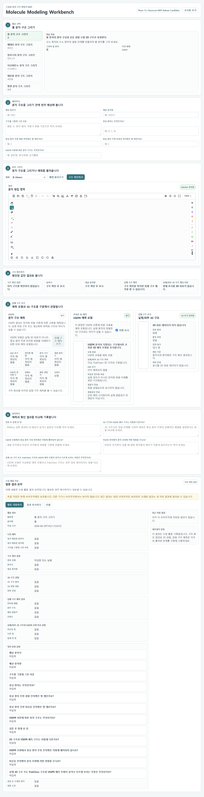
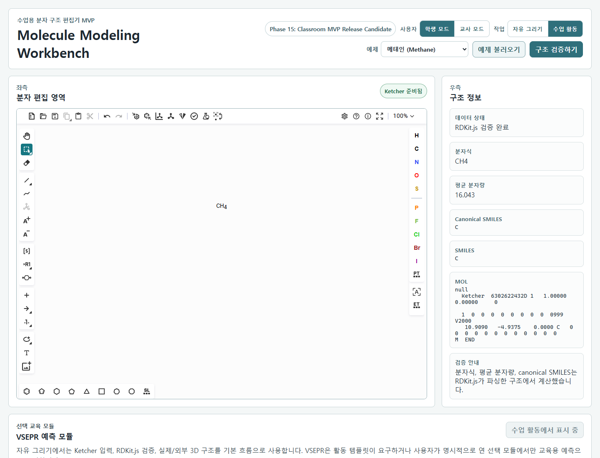
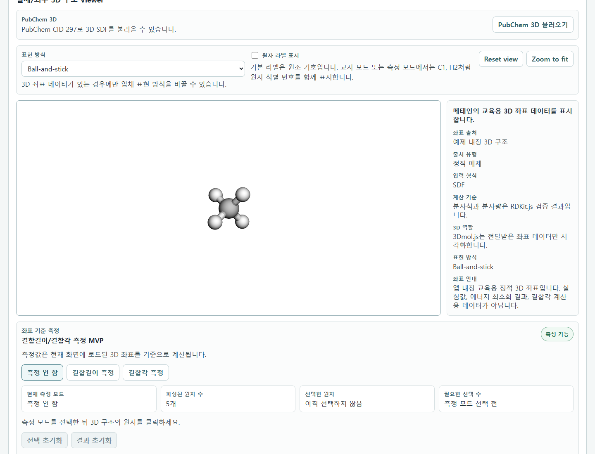
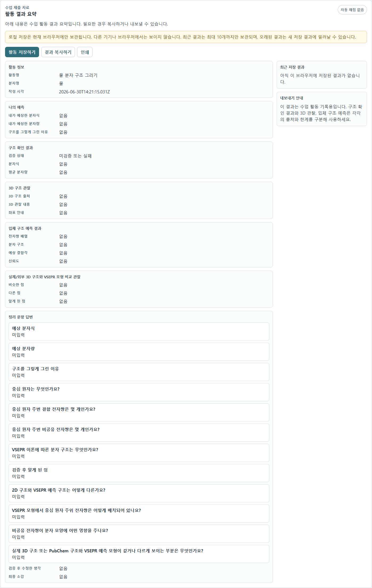

# 다양한 분자의 분자구조 모델링 사용 매뉴얼

작성일: 2026-06-30  
상태: Classroom MVP Release Candidate  
대상: 고등학교 화학 수업의 학생, 교사

다양한 분자의 분자구조 모델링은 수업용 ChemDraw-like 분자 구조 편집기입니다. 완전한 ChemDraw 복제가 아니라, 학생이 2D 구조를 그리고 검증된 분자 정보와 3D 시각화 자료를 구분해서 확인하도록 돕는 교육용 웹 앱입니다. 앱을 처음 열면 학생용 수업 활동 흐름이 기본으로 표시됩니다.


## 1. 실행 방법

로컬 개발 서버로 실행합니다.

```powershell
cd C:\all\molecule-modeling-skill-package\apps\workbench
npm install
npm run dev
```

브라우저에서 다음 주소를 엽니다.

```text
http://127.0.0.1:5173
```

빌드 확인은 다음 명령으로 수행합니다.

```powershell
npm run build
npm run typecheck
npm test
```

## 2. 화면 구성

화면은 크게 다음 영역으로 구성됩니다.

| 영역 | 용도 |
|---|---|
| 상단 헤더 | 사용자 모드, 앱 모드, 예제 분자 선택, 구조 검증 실행 |
| 좌측 편집 영역 | Ketcher 기반 2D 분자 구조 입력 |
| 우측 구조 정보 패널 | SMILES, MOL, RDKit.js 검증 결과 표시 |
| 외부 3D 자료 | 교사용/고급 보기에서 외부 3D 후보를 수동 검색 |
| 실제/외부 3D 구조 Viewer | 정적 좌표 또는 PubChem SDF 기반 3D 구조 표시 |
| VSEPR 예측 모듈 | 선택적으로 전자쌍 반발 이론 기반 교육용 예측 표시 |
| 수업 결과 요약 | 학생은 활동 저장/복사/인쇄, 교사는 JSON/Markdown/TXT 내보내기 |

## 3. 핵심 역할 구분

이 앱은 여러 도구를 사용하지만, 각 도구의 역할을 섞지 않습니다.

| 도구 | 담당 역할 | 주의 |
|---|---|---|
| Ketcher | 2D 분자 구조 입력기 | 구조를 그리는 도구이며 검증 기준이 아닙니다. |
| RDKit.js | SMILES/MOL 검증, canonical SMILES, 분자식, 평균 분자량 계산 | 학생에게 표시되는 분자식과 분자량의 기준입니다. |
| 3Dmol.js | 좌표 데이터 시각화 | 3D 구조를 생성하지 않고, 받은 좌표만 표시합니다. |
| PubChem | 외부 3D SDF 좌표 후보 제공 | PubChem 값이 RDKit.js 검증값을 대체하지 않습니다. |
| VSEPR 모듈 | 교육용 전자쌍 배열 예측 | 실제 측정 구조나 계산화학 최적화 구조가 아닙니다. |

## 4. 모드 선택

### 4.1 사용자 모드

기본 진입 화면은 `학생 모드 + 수업 활동`입니다. 학생 화면에서는 `교사용 보기` 버튼만 보이며, 교사용 보기에서 학생/교사 모드와 자유 그리기/수업 활동 모드를 전환할 수 있습니다.

| 모드 | 표시 내용 |
|---|---|
| 학생 모드 | 활동 선택, 구조 그리기, 예측 입력, 검증 결과, 3D 보기, 정리 입력 |
| 교사 모드 | 활동 지도 정보, 핵심 개념, 오개념 체크, 검증 상태, 개발자 로그 토글 |

교사 모드는 로그인 없이 단순 전환하는 MVP입니다. 학생별 제출 목록, DB 저장, 자동 채점은 포함하지 않습니다.


### 4.2 앱 모드

| 모드 | 사용 상황 |
|---|---|
| 자유 그리기 | 교사용/고급 보기에서 분자를 자유롭게 그리고 구조 확인, 3D 보기, 외부 후보 검색을 수행 |
| 수업 활동 | 기본 학생 화면. 교사가 준비한 활동 템플릿에 따라 예측, 구조 확인, 입체 구조 관찰, 정리 문항을 작성 |



## 5. 학생 기본 화면 사용법

학생 기본 화면은 다음 순서로 진행합니다.

1. `활동 선택`에서 수업 활동을 고릅니다.
2. `예측하기`에서 예상 분자식, 예상 분자량, 구조를 그렇게 그린 이유를 입력합니다.
3. `분자 그리기`에서 직접 구조를 그리거나 예제를 불러옵니다.
4. `구조 확인하기`를 누릅니다.
5. `구조 확인 결과`, `분자식`, `평균 분자량`, `입체 구조 예측`, `실제/외부 3D 구조 제공 여부` 카드를 확인합니다.
6. `입체 구조 보기`에서 실제/외부 3D 구조와 교육용 입체 구조 예측을 구분해 관찰합니다.
7. `정리하기`에서 활동 질문에 답합니다.
8. 필요하면 `활동 저장하기`, `결과 복사하기`, `인쇄`를 사용합니다.

학생 기본 화면에서는 canonical SMILES, MOL block, PubChem CID, JSON/Markdown/TXT 개별 내보내기, 개발자 로그를 표시하지 않습니다. 이 정보는 교사용/고급 보기에서만 확인합니다.

## 6. 자유 그리기 사용법

1. 상단에서 `자유 그리기`를 선택합니다.
2. 좌측 Ketcher 편집 영역에서 원자, 결합, 고리 도구를 사용해 구조를 그립니다.
3. 직접 그리기 어렵다면 상단 예제 분자 목록에서 예제를 선택합니다.
4. `구조 확인하기` 버튼을 누릅니다.
5. 우측 구조 정보 패널에서 추출된 SMILES/MOL과 RDKit.js 검증 결과를 확인합니다.
6. 검증이 성공하면 canonical SMILES, 분자식, 평균 분자량이 표시됩니다.
7. 검증이 실패하면 분자식과 분자량은 표시되지 않고 학생용 오류 안내가 표시됩니다.



## 7. 예제 분자 불러오기

상단 예제 분자 목록에서 수업용 예제를 선택할 수 있습니다.

현재 포함된 대표 예제는 다음과 같습니다.

| 예제 | SMILES | 수업 활용 |
|---|---|---|
| 물 | O | 굽은형 구조, 비공유 전자쌍 |
| 메테인 | C | 정사면체 구조 |
| 암모니아 | N | 삼각뿔형 구조 |
| 이산화탄소 | O=C=O | 선형 구조, 이중 결합의 전자쌍 영역 |
| 에탄올 | CCO | 여러 중심 원자별 국소 구조 |
| 아세트산 | CC(=O)O | 작용기와 분자식 검증 |
| 벤젠 | c1ccccc1 | 방향족 고리 구조 |
| 포도당 | C(C1C(C(C(C(O1)O)O)O)O)O | 큰 분자 구조 확인 |
| 아스피린 | CC(=O)OC1=CC=CC=C1C(=O)O | 방향족 고리와 작용기 |

예제를 선택하면 Ketcher에 2D 구조가 로드되고, `구조 확인하기`를 누르면 기존 검증 흐름을 그대로 통과합니다.

## 8. 구조 확인 결과 읽기

검증 성공 시 우측 정보 패널에 다음 값이 표시됩니다.

| 항목 | 의미 |
|---|---|
| canonicalSmiles | RDKit.js 기준의 표준화된 SMILES |
| molecularFormula | RDKit.js가 계산한 분자식 |
| molecularWeight | RDKit.js 결과를 기준으로 표시하는 평균 분자량 |
| validationStatus | 현재 구조의 검증 상태 |

검증 실패 시에는 학생에게 계산값을 보여주지 않습니다. 이 원칙은 수업 중 잘못된 구조에서 분자식이나 분자량을 확정값처럼 받아들이는 문제를 막기 위한 것입니다.

## 9. 실제/외부 3D 구조 Viewer 사용법

3D Viewer는 실제 또는 외부 좌표 데이터가 있을 때만 구조를 표시합니다.

1. 예제 분자를 선택합니다.
2. `구조 확인하기`를 눌러 구조 확인을 완료합니다.
3. 정적 3D 좌표가 있는 예제는 Viewer에 바로 표시될 수 있습니다.
4. PubChem CID가 연결된 예제는 `PubChem 3D 불러오기` 버튼으로 외부 3D SDF를 불러올 수 있습니다.
5. 좌표가 없으면 `3D 좌표 데이터가 아직 없습니다` 안내가 표시됩니다.



중요한 제한:

- SMILES만으로 임의의 3D 구조를 만들지 않습니다.
- 2D MOL block을 3D 구조라고 표시하지 않습니다.
- PubChem 3D 구조는 시각화 자료이며, 분자식/분자량 기준은 RDKit.js입니다.
- 결합각과 결합길이는 수업용 관찰 보조 자료로만 사용합니다.

## 10. 교사용/고급 보기에서 외부 3D 후보 검색 사용법

외부 3D 후보 검색은 학생 기본 화면에서는 숨겨져 있습니다. 교사용/고급 보기에서만 사용하며, 검색은 자동으로 실행되지 않습니다. 사용자가 직접 요청해야 합니다.

1. Ketcher에서 구조를 그립니다.
2. `구조 확인하기`를 눌러 검증을 통과합니다.
3. canonical SMILES가 표시되면 `PubChem 후보 검색` 버튼이 활성화됩니다.
4. 버튼을 눌러 외부 데이터 후보를 검색합니다.
5. 후보가 표시되면 사용자가 직접 CID 후보를 선택합니다.
6. 선택한 후보의 분자식이 현재 RDKit.js 검증값과 충돌하지 않을 때만 3D SDF를 불러옵니다.

후보가 1개여도 자동 선택하지 않습니다. PubChem 후보의 분자식과 분자량은 확인용 보조 정보이며, 메인 결과값을 덮어쓰지 않습니다.

네트워크 실패 또는 PubChem 응답 실패 시:

- 학생에게는 `PubChem에서 이 분자의 3D 구조 데이터를 불러오지 못했습니다`와 같은 안내를 표시합니다.
- 교사/개발자 로그에는 CID, HTTP status, 오류 원인을 남깁니다.
- 2D 구조와 RDKit.js 검증 결과는 계속 사용할 수 있습니다.

## 11. 입체 구조 예측 모듈 사용법

VSEPR 모듈은 선택 교육 모듈입니다. 실제 3D 구조를 생성하는 기능이 아니라, 중심 원자 주변 전자쌍 배열을 설명하는 교육용 예측입니다.

1. RDKit.js 검증을 통과한 구조를 준비합니다.
2. 자유 그리기 모드에서는 `입체 구조 예측 보기`를 눌러 표시합니다.
3. 중심 원자가 하나로 명확하면 자동 분석됩니다.
4. 에탄올처럼 중심 원자 후보가 여러 개이면 중심 원자를 선택해 국소 구조를 확인합니다.
5. `입체 구조 예측 보기`를 누르면 교육용 3D 예측 모형이 표시됩니다.

표시되는 항목:

- AXE 표기
- 전자쌍 배열
- 분자 구조
- 비공유 전자쌍 수
- 예상 결합각
- 신뢰도와 경고

주의:

- VSEPR 결과는 실제 실험 구조가 아닙니다.
- 비공유 전자쌍 표시는 실제 입자가 아니라 방향 이해를 위한 시각화입니다.
- 복잡한 공명 구조, 전이금속, 라디칼은 제한적으로 처리합니다.
- 다중 중심 분자는 전체 분자를 하나의 VSEPR 구조로 단정하지 않고 중심 원자별로 봅니다.

## 12. 실제 3D 구조와 VSEPR 예측 비교

비교 모드는 RDKit.js 검증을 통과한 구조에서 실제/외부 3D 좌표와 VSEPR 교육용 예측을 구분해서 보여줍니다.

예시:

| 분자 | 실제/외부 3D | VSEPR | 해석 |
|---|---|---|---|
| 메테인 CH4 | 정사면체 | AX4, 정사면체 | 거의 같은 구조로 보일 수 있습니다. |
| 암모니아 NH3 | 삼각뿔형 | AX3E, 삼각뿔형 | 비공유 전자쌍 때문에 평면이 아닙니다. |
| 물 H2O | 굽은형 | AX2E2, 굽은형 | 비공유 전자쌍 2쌍이 중요합니다. |
| 이산화탄소 CO2 | 선형 | AX2, 선형 | 이중 결합도 전자쌍 영역 1개로 봅니다. |
| 에탄올 C2H6O | 전체 3D 구조 | 중심 원자별 국소 구조 | 전체 분자를 하나의 VSEPR 구조로 단정하지 않습니다. |

## 13. 수업 활동 모드 사용법

수업 활동 모드는 학생이 예측한 뒤 구조를 그리고 검증 결과와 비교하는 흐름입니다.

1. 상단에서 `수업 활동`을 선택합니다.
2. 활동 목록에서 활동을 선택합니다.
3. 학습 목표와 안내 문항을 읽습니다.
4. 예상 분자식, 예상 분자량, 구조를 그렇게 그린 이유를 입력합니다.
5. Ketcher에서 구조를 그리거나 추천 예제를 불러옵니다.
6. `구조 확인하기`를 누릅니다.
7. RDKit.js 검증 결과와 자신의 예측값을 비교합니다.
8. VSEPR 또는 3D 구조 관찰 질문에 답합니다.
9. 정리 문항을 작성합니다.

예측값 비교는 단순 문자열 비교입니다. 화학적으로 동치인 다른 표기까지 자동 판정하지 않으며, 자동 점수화도 하지 않습니다.

## 14. 교사 모드 사용법

교사 모드는 수업 운영 참고 화면입니다.

교사 모드에서 확인할 수 있는 내용:

- 현재 선택된 활동 템플릿
- 학습 목표
- 핵심 개념
- 예상 분자식
- 예상 VSEPR 구조
- 학생 입력 문항 목록
- RDKit 검증 상태
- VSEPR 분석 상태
- 3D 구조 제공 상태
- PubChem 연결 상태
- 오개념 체크 포인트
- 접을 수 있는 개발자 로그

교사 모드에서 하지 않는 일:

- 학생별 로그인
- 학생 제출 DB 저장
- 자동 채점
- 교사용 대시보드
- 정답/오답 자동 판정

## 15. 활동 결과 저장과 내보내기

수업 활동 결과는 현재 브라우저의 로컬 저장소에 저장할 수 있습니다.



학생 기본 화면에서 사용할 수 있는 기능:

| 버튼 | 기능 |
|---|---|
| 활동 저장하기 | 현재 활동 결과를 브라우저 localStorage에 저장 |
| 결과 복사하기 | Markdown 형식 결과를 클립보드에 복사 |
| 인쇄 | 인쇄용 화면 열기 |

교사용/고급 보기에서 추가로 사용할 수 있는 기능:

| 버튼 | 기능 |
|---|---|
| JSON 내보내기 | 기계 판독용 활동 결과 파일 저장 |
| Markdown 내보내기 | 교사와 AI가 읽기 쉬운 보고서 형식 저장 |
| TXT 내보내기 | 단순 텍스트 결과 저장 |

제한:

- 로컬 저장은 현재 브라우저와 기기에만 남습니다.
- 개인정보나 학생 실명 입력은 권장하지 않습니다.
- 브라우저 저장 공간 문제나 private mode에서는 저장이 실패할 수 있습니다.

## 16. 수업 운영 예시

### 물 분자 구조 수업

1. 활동 모드에서 `물 분자 구조 그리기`를 선택합니다.
2. 학생은 H-O-H 구조를 예측하고 예상 분자식을 입력합니다.
3. Ketcher에서 물 구조를 작성합니다.
4. RDKit.js 검증값으로 분자식과 분자량을 확인합니다.
5. VSEPR에서 AX2E2, 굽은형 구조를 확인합니다.
6. 실제/외부 3D 구조와 VSEPR 모형이 왜 굽은형으로 보이는지 토의합니다.

### 메테인 구조 수업

1. 메테인 예제를 불러옵니다.
2. 학생에게 종이에 평면 십자형으로 그리는 오개념이 있는지 확인합니다.
3. VSEPR AX4 정사면체 예측을 확인합니다.
4. 실제/외부 3D 구조와 VSEPR 예측 모형을 비교합니다.

### 에탄올 구조 수업

1. 에탄올 예제를 선택합니다.
2. 전체 분자를 하나의 VSEPR 구조로 단정하지 않도록 안내합니다.
3. 중심 C 또는 O 원자별 국소 구조를 비교합니다.
4. PubChem 3D 구조는 전체 좌표 시각화이고, VSEPR은 중심 원자 주변 예측임을 구분합니다.

## 17. 문제 해결

| 문제 | 확인할 점 |
|---|---|
| Ketcher 화면이 비어 있음 | 새로고침 후 Ketcher 준비 상태가 표시되는지 확인합니다. |
| 구조 검증 버튼을 눌러도 실패함 | 빈 구조, 원자가 오류, 끊어진 결합이 있는지 확인합니다. |
| 분자식/분자량이 표시되지 않음 | RDKit.js 검증 실패 상태에서는 계산값을 표시하지 않습니다. |
| PubChem 3D가 불러와지지 않음 | 네트워크 상태, CID 존재 여부, PubChem 3D 데이터 존재 여부를 확인합니다. |
| 3D Viewer가 안내 문구만 표시함 | 해당 분자에 정적 또는 외부 3D 좌표가 없을 수 있습니다. |
| VSEPR 결과가 제한적으로 보임 | 지원 원소와 중심 원자 후보가 MVP 범위 안인지 확인합니다. |
| 로컬 저장 실패 | 브라우저 저장소 권한, private mode, 저장 공간을 확인하고 결과 복사하기 또는 교사용 내보내기를 사용합니다. |

## 18. 과학 정확성 및 사용 한계

이 앱은 수업용 MVP입니다. 다음 원칙을 지켜 사용해야 합니다.

- 검증되지 않은 구조에서 분자식과 분자량을 확정값처럼 사용하지 않습니다.
- RDKit.js 결과를 분자식과 평균 분자량의 기준으로 사용합니다.
- PubChem 3D 구조는 외부 좌표 시각화 자료입니다.
- VSEPR 모형은 이상화된 교육용 예측이며 실제 측정 구조가 아닙니다.
- 결합각, 결합길이, 에너지 최소화, 양자화학 계산은 제공하지 않습니다.
- 학생 개인정보를 앱에 입력하거나 저장하지 않는 방식으로 운영합니다.

## 19. 현재 MVP에서 의도적으로 제외한 기능

- ChemDraw 전체 기능 복제
- 학생 로그인
- 교사용 대시보드
- DB 저장
- Firebase 연동
- 자동 채점
- RDKit 3D conformer 생성
- Open Babel 백엔드
- 에너지 최소화
- PubChem 자동 매칭
- 실험값 수준의 결합각/결합길이 계산

## 20. 수업 전 체크리스트

- [ ] 로컬 서버가 `http://127.0.0.1:5173`에서 열린다.
- [ ] Ketcher 편집기가 표시된다.
- [ ] 예제 분자 하나를 불러와 `구조 확인하기`가 동작한다.
- [ ] RDKit.js 분자식과 평균 분자량이 표시된다.
- [ ] 3D 좌표가 있는 예제와 없는 예제의 안내가 구분된다.
- [ ] PubChem 사용 수업이면 인터넷 연결을 확인한다.
- [ ] 학생에게 VSEPR 모형과 실제/외부 3D 구조의 차이를 미리 안내한다.
- [ ] 활동 결과 저장 시 학생 개인정보를 넣지 않도록 안내한다.
