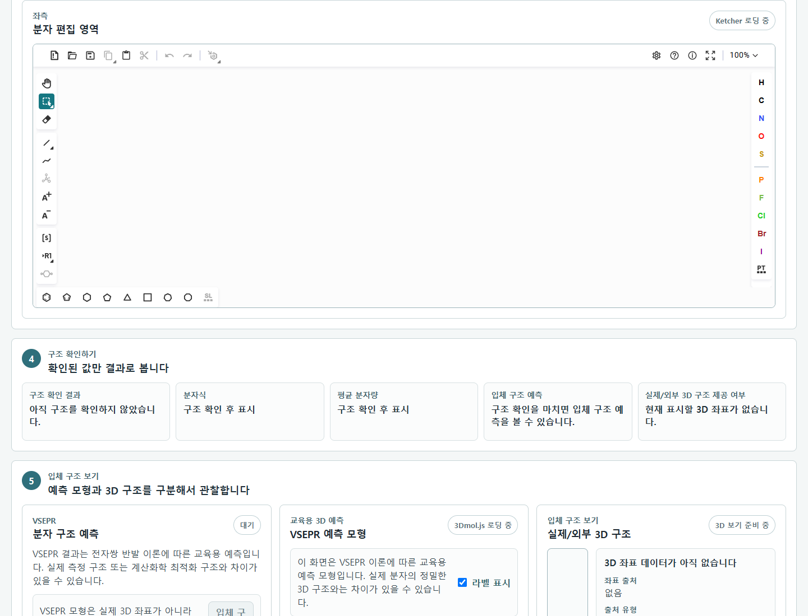
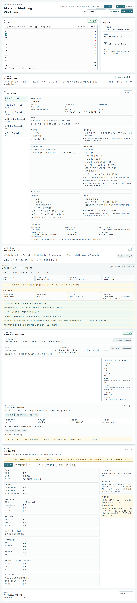
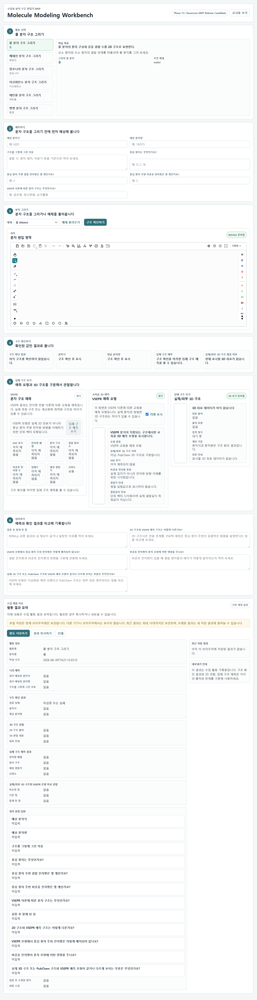
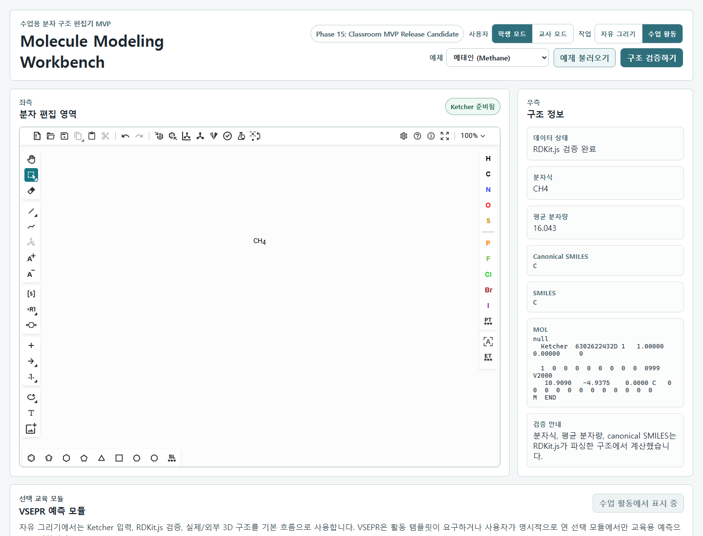
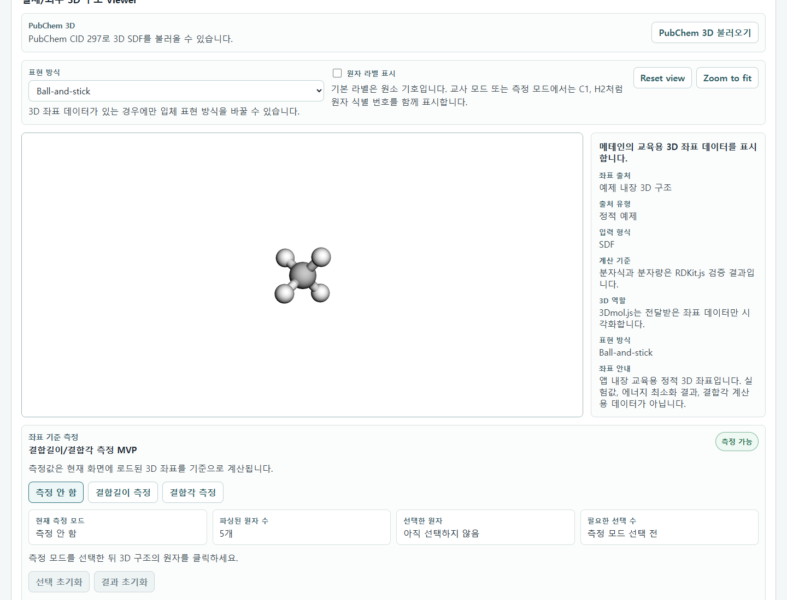
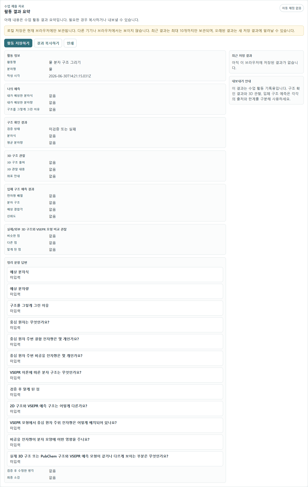

# 다양한 분자의 분자구조 모델링 사용 매뉴얼

최초 작성일: 2026-07-12
현재 addendum: 2026-07-27
상태: unreleased release candidate / 5단계 학생 흐름 로컬 QA 완료
대상: 고등학교 화학 수업의 학생, 교사

다양한 분자의 분자구조 모델링은 수업용 ChemDraw-like 분자 구조 편집기입니다. 완전한 ChemDraw 복제가 아니라, 학생이 2D 구조를 그리고 검증된 분자 정보와 3D 시각화 자료를 한 작업 화면에서 확인하도록 돕는 웹 앱입니다.

> **현재 기준:** 루트 `CODEX 분자구조모델링 메타프롬프트.md`의 UX·QA
> 요구사항을 적용합니다. 2026-07-12의 “단계 진행 UI가 없는 직접 작업형
> 학생 화면” 결정은 **SUPERSEDED 2026-07-27**이며 이력으로만 보존합니다.
> 현재 화면은 잠금 없는 5단계 흐름과 모바일 5탭을 사용합니다. 이 매뉴얼은
> production 배포 완료를 선언하지 않습니다.



이 문서의 기존 이미지 자산은 이전 UI 이력 참고용입니다. 2026-07-27
5단계 화면은 `qa-screenshots/final/`의 6개 브라우저 증거로 확인했습니다.
현재 동작은 이 addendum와 실제 코드 설명을 우선합니다.

## 1. 실행 방법

로컬 개발 서버로 실행합니다.

```powershell
cd C:\all\molecule-modeling-skill-package\apps\workbench
npm install
npm run dev
```

브라우저에서 다음 주소를 엽니다.

```text
http://127.0.0.1:5173
```

빌드 확인은 다음 명령으로 수행합니다.

```powershell
npm run build
npm run typecheck
npm test
```

## 2. 화면 구성

화면은 크게 다음 영역으로 구성됩니다.

| 영역 | 용도 |
|---|---|
| 상단 5단계 진행 | `분자 선택·구조 만들기·구조 분석·3D 비교·생각 정리·제출` 상태와 이동 |
| 모바일 5탭 | `선택·그리기·분석·3D·기록` 축약 이동 |
| 2D 편집 영역 | Ketcher 간편/고급 편집 모드와 구조 입력 |
| 구조 분석 결과 | RDKit.js 검증 기반 연결 근거(A/B/C), 핵심 정보와 접힌 기타 정보 |
| VSEPR 근거표 | 선택 중심 원자와 결합/비공유/전체 전자 영역, 국소 모양, VSEPR 이상각 |
| 외부 3D 자료 | 구조 분석 성공 후 학생/교사가 명시적으로 후보를 검색하고 선택 |
| 참고 3D 구조 | 정적 좌표 또는 PubChem SDF 기반 3D 구조 표시 |
| VSEPR 예상 모형 | 전자쌍 반발 이론 기반 교육용 예측 표시 |
| 생각 정리·제출 | 학생 판단과 근거 작성, 제출 상태, 반환된 교사 피드백 |

## 3. 핵심 역할 구분

이 앱은 여러 도구를 사용하지만, 각 도구의 역할을 섞지 않습니다.

| 도구 | 담당 역할 | 주의 |
|---|---|---|
| Ketcher | 2D 분자 구조 입력기 | 구조를 그리는 도구이며 검증 기준이 아닙니다. |
| RDKit.js | SMILES/MOL 검증, canonical SMILES, 분자식, 평균 분자량 계산 | 학생에게 표시되는 분자식과 분자량의 기준입니다. |
| 3Dmol.js | 좌표 데이터 시각화 | 3D 구조를 생성하지 않고, 받은 좌표만 표시합니다. |
| PubChem | 외부 3D SDF 좌표 후보 제공 | PubChem 값이 RDKit.js 검증값을 대체하지 않습니다. |
| VSEPR 모듈 | 교육용 전자쌍 배열 예측 | 실제 측정 구조나 계산화학 최적화 구조가 아닙니다. |

## 4. 모드 선택

### 4.1 사용자 모드

기본 진입 화면은 `학생 모드 + 수업 활동`입니다. 학생 화면은 5단계 학습
흐름을 사용하며, 교사용 보기에서 교사 기능과 고급 진단 기능을 확인합니다.

| 모드 | 표시 내용 |
|---|---|
| 학생 모드 | 5단계 이동, 간편/고급 구조 편집, 구조 분석, VSEPR 근거표, 3D 비교, 생각·제출·피드백 |
| 교사 모드 | 활동 지도 정보, 핵심 개념, 오개념 체크, 검증 상태, 개발자 로그 토글 |

교사 모드는 Firebase Auth 로그인을 사용할 수 있습니다. 교사 권한이 확인된 계정은 수업방을 만들고, 학생 제출 자료를 조회하고, AI 피드백 초안을 만든 뒤 교사 검토 후 학생에게 반환할 수 있습니다. 자동 채점은 포함하지 않습니다.



### 4.2 앱 모드

| 모드 | 사용 상황 |
|---|---|
| 자유 그리기 | 교사용/고급 보기에서 분자를 자유롭게 그리고 구조 확인, 3D 보기, 외부 후보 검색을 수행 |
| 수업 활동 | 기본 학생 화면. 지정된 분자를 5단계 흐름에서 만들고 분석·비교·제출 |



## 5. 학생 기본 화면 사용법

학생 기본 화면은 다음 5단계를 한 페이지에 배치하고, 진행 레일 또는 모바일
5탭으로 자유롭게 이동합니다. 단계 잠금은 없습니다.

1. `분자 선택`: 교사가 허용한 활동 중 탐구할 분자를 고릅니다.
2. `구조 만들기`: `예시 구조 불러오기`를 사용하거나 직접 그립니다.
   기본 `간편 모드`는 핵심 도구를 우선 표시하며, 필요할 때 `고급 편집 모드`로
   전환합니다. 탄소 사슬은 왼쪽 `사슬(Chain)` 도구를 고른 뒤 빈 캔버스에서
   누른 채 드래그합니다. 원자를 따로 여러 번 놓으면 연결되지 않은 조각이
   되므로 결합선이 이어졌는지 확인합니다. `구조 초기화`는 현재 구조를 비웁니다.
3. `구조 분석`: `2D 구조 분석하기`를 누릅니다. RDKit.js 검증 성공 후에만
   분자식과 VSEPR 근거를 표시합니다. 결과의 원자 수(A), 결합 수(B), 연결
   성분 수(C)로 의도한 하나의 구조가 만들어졌는지 확인합니다.
4. `3D 비교`: `VSEPR 예상 모형`과 좌표 기반 `참고 3D 구조`를 구분해
   관찰하고 비교 질문을 확인합니다.
5. `생각 정리·제출`: `나의 판단과 근거`를 작성하고
   `교사에게 제출하기`를 누릅니다. 이후 `교사 피드백 확인하기`로 반환된
   형성 피드백을 확인합니다.

완료, 검토 필요, 오류 표시는 실제 구조 분석·3D·작성·제출 상태를 반영합니다.
모바일 축약 탭은 `선택·그리기·분석·3D·기록`입니다.

학생 기본 화면에서는 canonical SMILES, MOL block, PubChem CID, JSON/Markdown/TXT 개별 내보내기, 개발자 로그를 표시하지 않습니다. 이 정보는 교사용/고급 보기에서만 확인합니다.

## 6. 자유 그리기 사용법

1. 상단에서 `자유 그리기`를 선택합니다.
2. 좌측 Ketcher 편집 영역에서 원자, 결합, 고리 도구를 사용해 구조를 그립니다.
   사슬은 `사슬(Chain)` 도구로 시작점을 누른 채 드래그해 한 번에 연결합니다.
3. 직접 그리기 어렵다면 상단 예제 분자 목록에서 예제를 선택합니다.
4. `2D 구조 분석하기` 버튼을 누릅니다.
5. 우측 구조 정보 패널에서 추출된 SMILES/MOL과 RDKit.js 검증 결과를 확인합니다.
6. 검증이 성공하면 canonical SMILES, 분자식, 평균 분자량이 표시됩니다.
7. 검증이 실패하면 분자식과 분자량은 표시되지 않고 학생용 오류 안내가 표시됩니다.



## 7. 예제 분자 불러오기

상단 예제 분자 목록에서 수업용 예제를 선택할 수 있습니다.

현재 포함된 대표 예제는 다음과 같습니다.

| 예제 | SMILES | 수업 활용 |
|---|---|---|
| 물 | O | 굽은형 구조, 비공유 전자쌍 |
| 메테인 | C | 정사면체 구조 |
| 암모니아 | N | 삼각뿔형 구조 |
| 이산화탄소 | O=C=O | 선형 구조, 이중 결합의 전자쌍 영역 |
| 에탄올 | CCO | 여러 중심 원자별 국소 구조 |
| 아세트산 | CC(=O)O | 작용기와 분자식 검증 |
| 벤젠 | c1ccccc1 | 방향족 고리 구조 |
| 포도당 | C(C1C(C(C(C(O1)O)O)O)O)O | 큰 분자 구조 확인 |
| 아스피린 | CC(=O)OC1=CC=CC=C1C(=O)O | 방향족 고리와 작용기 |

예제를 선택하고 `예시 구조 불러오기`를 누르면 Ketcher에 2D 구조가 로드됩니다.
이후 `2D 구조 분석하기`를 눌러도 직접 그린 구조와 같은 검증 흐름을 통과합니다.

## 8. 구조 분석 결과 읽기

학생 기본 화면은 다음 핵심 정보를 먼저 표시합니다.

| 항목 | 의미 |
|---|---|
| 연결 상태 근거 | RDKit 그래프의 원자 수, 결합 수, 연결 성분 수. 단일 분자 활동은 연결 성분 1개여야 함 |
| 구조 분석 결과 | 분석 가능한 구조인지 또는 무엇을 다시 확인해야 하는지 안내 |
| 분자식 | RDKit.js가 검증된 구조에서 계산한 값 |
| 선택 중심 원자 | 현재 VSEPR 국소 분석의 기준 원자. `C1`, `O3`처럼 위치 번호를 함께 표시 |
| 전체 전자 영역 | 결합 전자 영역과 비공유 전자쌍을 합한 수 |
| 전자쌍 배열 | 전자 영역이 배치되는 기하 |
| 선택 중심 주변 분자 모양 | 선택한 중심 원자 주변 결합 원자의 이상화된 국소 배치 이름 |

`기타 정보`에는 평균 분자량, 전자쌍 모형 표기, 참고 3D 제공 여부가
들어 있습니다. canonical SMILES와 원시 MOL 같은 기술 정보는 학생 기본
화면에 표시하지 않습니다.

검증 실패 시에는 계산값이나 확신형 VSEPR 결과를 보여주지 않습니다. 연결
성분이 2개 이상이면 원자를 더 놓는 대신 기존 원자 사이에 결합을 만든 뒤
`2D 구조 분석하기`를 다시 누릅니다.

## 9. 실제/외부 3D 구조 Viewer 사용법

3D Viewer는 실제 또는 외부 좌표 데이터가 있을 때만 구조를 표시합니다.

1. 예제 분자를 선택합니다.
2. `2D 구조 분석하기`를 눌러 구조 분석을 완료합니다.
3. 정적 3D 좌표가 있는 예제는 Viewer에 바로 표시될 수 있습니다.
4. 외부 3D 자료를 사용할 수 있는 예제는 `참고 3D 구조 불러오기`로 좌표 데이터를 불러올 수 있습니다.
5. 좌표가 없으면 `3D 좌표 데이터가 아직 없습니다` 안내가 표시됩니다.



중요한 제한:

- SMILES만으로 임의의 3D 구조를 만들지 않습니다.
- 2D MOL block을 3D 구조라고 표시하지 않습니다.
- PubChem 3D 구조는 시각화 자료이며, 분자식/분자량 기준은 RDKit.js입니다.
- 결합각과 결합길이는 수업용 관찰 보조 자료로만 사용합니다.

## 10. 외부 3D 후보 검색 사용법

외부 3D 후보 검색은 학생 4단계와 교사용/고급 보기에서 사용할 수 있습니다.
검색은 자동으로 실행되지 않으며 사용자가 직접 요청하고 후보를 선택해야
합니다. 학생 화면은 후보 번호와 원시 구조 문자열을 숨긴 간소화 표시를
사용합니다.

1. Ketcher에서 구조를 그립니다.
2. `2D 구조 분석하기`를 눌러 검증을 통과합니다.
3. 내부 검증 구조 키가 준비되면 `외부 3D 자료 찾기`가 활성화됩니다.
4. 버튼을 눌러 외부 데이터 후보를 검색합니다.
5. 후보가 표시되면 학생은 `이 자료 선택`, 교사용/고급 보기는
   `이 3D 자료 불러오기`를 눌러 직접 선택합니다.
6. 선택한 후보의 분자식이 현재 RDKit.js 검증값과 충돌하지 않을 때만 3D SDF를 불러옵니다.

후보가 1개여도 자동 선택하지 않습니다. PubChem 후보의 분자식과 분자량은 확인용 보조 정보이며, 메인 결과값을 덮어쓰지 않습니다.

네트워크 실패 또는 PubChem 응답 실패 시:

- 학생에게는 `PubChem에서 이 분자의 3D 구조 데이터를 불러오지 못했습니다`와 같은 안내를 표시합니다.
- 교사/개발자 로그에는 CID, HTTP status, 오류 원인을 남깁니다.
- 2D 구조와 RDKit.js 검증 결과는 계속 사용할 수 있습니다.

## 11. VSEPR 근거표와 예상 모형 사용법

VSEPR은 실제 3D 구조 생성기가 아니라 선택한 중심 원자 주변 전자 영역으로
국소 모양을 추론하는 교육용 예측 층입니다.

1. `2D 구조 분석하기`로 RDKit.js 검증을 통과합니다.
2. `VSEPR 근거표`에서 선택 중심 원자, 결합 전자 영역 수, 비공유 전자쌍 수,
   전체 전자 영역 수, 전자쌍 배열, 선택 중심 주변 모양, VSEPR 이상각(이론)을
   순서대로 확인합니다.
3. 중심 원자 후보가 여러 개이면 드롭다운에서 분석할 중심 원자를 고릅니다.
4. 지원되는 구조에서 `VSEPR 예상 모형 준비하기`를 눌러 교육용 모형을
   표시합니다.
5. `전자쌍 배열 보기`와 `원자만 보기`를 전환하고,
   `비공유 전자쌍 표시`, `초기 방향`, `화면에 맞추기`를 사용합니다.

주의:

- VSEPR 결과는 실제 실험 구조가 아닙니다.
- VSEPR 이상각(이론), 현재 3D 좌표에서 잰 각, 출처가 있는 문헌 참고각은
  서로 다른 근거이므로 합쳐서 하나의 확정값처럼 쓰지 않습니다.
- 비공유 전자쌍 표시는 실제 입자가 아니라 방향 이해를 위한 시각화입니다.
- 복잡한 공명 구조, 전이금속, 라디칼은 제한적으로 처리합니다.
- 다중 중심 분자는 전체 분자를 하나의 VSEPR 구조로 단정하지 않고 중심 원자별로 봅니다.

## 12. 실제 3D 구조와 VSEPR 예측 비교

학생 4단계 `3D 비교`는 RDKit.js 검증을 통과한 구조의 참고 3D 좌표와
VSEPR 예상 모형을 구분해서 보여줍니다. 데스크톱은 두 뷰어를 나란히,
모바일은 `VSEPR 예상 모형`/`참고 3D 구조` 선택 버튼으로 표시합니다.

예시:

| 분자 | 실제/외부 3D | VSEPR | 해석 |
|---|---|---|---|
| 메테인 CH4 | 정사면체 | AX4, 정사면체 | 거의 같은 구조로 보일 수 있습니다. |
| 암모니아 NH3 | 삼각뿔형 | AX3E, 삼각뿔형 | 비공유 전자쌍 때문에 평면이 아닙니다. |
| 물 H2O | 굽은형 | AX2E2, 굽은형 | 비공유 전자쌍 2쌍이 중요합니다. |
| 이산화탄소 CO2 | 선형 | AX2, 선형 | 이중 결합도 전자쌍 영역 1개로 봅니다. |
| 에탄올 C2H6O | 전체 3D 구조 | 중심 원자별 국소 구조 | 전체 분자를 하나의 VSEPR 구조로 단정하지 않습니다. |

## 13. 수업 활동 템플릿과 5단계 흐름

수업 활동 템플릿은 학생에게 허용할 분자와 활동 안내를 정합니다. 학생은
템플릿을 선택한 뒤 5단계 흐름에서 구조를 만들고 분석·비교·제출합니다.
과거의 예상 분자식/예상 분자량 입력과 문자열 비교 중심 흐름은
**SUPERSEDED 2026-07-27**이며, 레거시 저장 데이터 호환용 필드만 남아
있습니다. 자동 점수화는 하지 않습니다.

## 14. 교사 모드 사용법

교사 모드는 수업 운영 참고 화면입니다.

교사 모드에서 확인할 수 있는 내용:

- 현재 선택된 활동 템플릿
- 학습 목표
- 핵심 개념
- 예상 분자식
- 예상 VSEPR 구조
- 학생 입력 문항 목록
- RDKit 검증 상태
- VSEPR 분석 상태
- 3D 구조 제공 상태
- PubChem 연결 상태
- 오개념 체크 포인트
- 접을 수 있는 개발자 로그
- 서버 제출 목록
- AI 피드백 초안
- 학생에게 반환한 교사 피드백

교사 모드에서 하지 않는 일:

- 자동 채점
- 정답/오답 자동 판정

## 14.1 학생 제출과 교사용 AI 피드백 반환

Firebase와 Vercel 환경변수가 준비된 배포본에서는 다음 흐름을 사용할 수 있습니다.

### 학생 제출

1. 학생은 윤리 가이드와 약관 게이트를 확인한 뒤 `학생 활동`으로 입장합니다.
2. 교사가 안내한 `수업코드`, `학생 입장 확인코드`, `수업용 이름`을 입력합니다.
3. 수업방 입장이 확인되면 교사가 선택한 활동 템플릿만 학생 화면에 표시됩니다.
4. 학생은 구조를 분석하고 3D 비교를 수행한 뒤 5단계에서 판단과 근거를 작성합니다.
5. 구조 분석 성공, 현재 구조의 3D 비교 단계 방문, 생각 작성, trusted 수업방 입장, Firebase ID token 조건이 완료되면 `교사에게 제출하기`가 활성화됩니다.
6. 버튼을 누르면 Firestore 서버 제출함에 저장을 요청합니다. 서버 저장 성공이
   확인되어야 제출 완료로 표시됩니다. 실패하면 답변은 현재 학생 세션에 남아
   있으므로 연결을 확인한 뒤 다시 제출할 수 있습니다.

### 교사 확인

1. 교사는 `교사용 안내`에서 Google 또는 이메일 로그인으로 입장합니다.
2. 교사 권한이 확인되면 수업방 생성과 서버 제출 목록 조회가 가능합니다.
3. Firebase 로그인이 어려울 때는 `VITE_EMERGENCY_TEACHER_USERNAME`, `VITE_EMERGENCY_TEACHER_PASSWORD`가 설정된 배포본에서만 긴급 교사용 보기로 임시 진입할 수 있습니다.
4. 긴급 로그인 값은 공개 저장소에 커밋하지 않습니다. 이 값은 브라우저 번들에 노출될 수 있으므로 실제 계정 비밀번호를 재사용하지 않습니다.
5. 긴급 로그인은 Firebase ID token을 만들지 않으므로 서버 제출 조회, 수업방 생성, 피드백 반환 같은 Firestore 기능 권한으로 사용하지 않습니다.
6. `서버 제출 목록 불러오기`를 눌러 학생 제출 자료를 확인합니다.
7. 제출 자료를 선택한 뒤 `AI 피드백 초안 만들기`를 누릅니다.
8. 서버의 `/api/create-feedback-draft`가 교사 권한과 수업방 배정을 확인한 뒤 피드백 초안을 만듭니다.
9. Vercel 환경변수 `GEMINI_API_KEY`가 있으면 Gemini API로 초안을 만들고, 없거나 실패하면 로컬 가드레일 기반 초안을 만듭니다.
10. 교사는 초안을 읽고 필요한 문장을 수정합니다.
11. `교사 확인 후 학생에게 전달`을 누르면 Firestore 제출 문서에 피드백이 저장됩니다.

### 학생 피드백 확인

1. 학생이 같은 수업방에 다시 입장하면 본인 제출에 반환된 교사 피드백을 불러옵니다.
2. 5단계에서 `교사 피드백 확인하기`를 눌러 새로고침할 수 있습니다.
3. 피드백은 점수나 등급이 아니라 형성 피드백으로 표시됩니다.
4. AI가 만든 초안도 교사가 확인한 뒤에만 학생에게 전달합니다.

### AI 피드백 사용 제한

- AI 피드백은 자동 채점 기능이 아닙니다.
- AI는 학생의 성취도, 태도, 인성을 단정하지 않습니다.
- 화학적으로 검증되지 않은 값을 확정 사실처럼 말하지 않습니다.
- 교사는 전달 전 과학 내용, 표현, 개인정보 포함 여부를 반드시 확인해야 합니다.

## 15. 활동 결과 저장과 내보내기

수업 활동 결과는 현재 브라우저의 로컬 저장소에 저장할 수 있습니다.



현재 학생 기본 5단계 화면은 `교사에게 제출하기`와 반환 피드백 확인을
중심으로 합니다. 과거 학생 기본 화면의 로컬 저장·보고서·인쇄 버튼은
**SUPERSEDED 2026-07-27**이며 현재 기본 흐름에 표시되지 않습니다.

교사용/고급 보기의 기존 결과 패널에서는 다음 형식을 사용할 수 있습니다.

| 버튼 | 기능 |
|---|---|
| JSON 내보내기 | 기계 판독용 활동 결과 파일 저장 |
| Markdown 내보내기 | 교사와 AI가 읽기 쉬운 보고서 형식 저장 |
| TXT 내보내기 | 단순 텍스트 결과 저장 |

제한:

- 로컬 저장은 현재 브라우저와 기기에만 남습니다.
- 로컬 활동 결과 저장과 `교사에게 제출하기`는 서로 다른 기능입니다. 학생
  닉네임·답변·구조 snapshot이 포함된 교사 제출 자료는 브라우저 제출함
  `localStorage` fallback으로 보관하지 않습니다.
- 개인정보나 학생 실명 입력은 권장하지 않습니다.
- 브라우저 저장 공간 문제나 private mode에서는 저장이 실패할 수 있습니다.

## 16. 수업 운영 예시

### 물 분자 구조 수업

1. 활동 모드에서 `물 분자 구조 그리기`를 선택합니다.
2. Ketcher에서 물 구조를 작성하거나 예시 구조를 불러옵니다.
3. `2D 구조 분석하기`로 RDKit.js 검증값과 분자식을 확인합니다.
4. VSEPR 근거표에서 중심 O, 결합 전자 영역 2, 비공유 전자쌍 2,
   전체 전자 영역 4, 전자쌍 배열과 굽은형 구조를 확인합니다.
5. 참고 3D 구조와 VSEPR 예상 모형이 왜 굽은형으로 보이는지 토의합니다.
6. 판단과 근거를 작성해 교사에게 제출합니다.

### 메테인 구조 수업

1. 메테인 예제를 불러옵니다.
2. 학생에게 종이에 평면 십자형으로 그리는 오개념이 있는지 확인합니다.
3. VSEPR AX4 정사면체 예측을 확인합니다.
4. 실제/외부 3D 구조와 VSEPR 예측 모형을 비교합니다.

### 에탄올 구조 수업

1. 에탄올 예제를 선택합니다.
2. 전체 분자를 하나의 VSEPR 구조로 단정하지 않도록 안내합니다.
3. 중심 C 또는 O 원자별 국소 구조를 비교합니다.
4. PubChem 3D 구조는 전체 좌표 시각화이고, VSEPR은 중심 원자 주변 예측임을 구분합니다.

## 17. 문제 해결

| 문제 | 확인할 점 |
|---|---|
| Ketcher 화면이 비어 있음 | 새로고침 후 Ketcher 준비 상태가 표시되는지 확인합니다. |
| `2D 구조 분석하기`가 실패함 | 빈 구조, 원자가 오류, 끊어진 결합을 확인하고 안내된 최소 힌트에 따라 수정합니다. |
| 분자식/분자량이 표시되지 않음 | RDKit.js 검증 실패 상태에서는 계산값을 표시하지 않습니다. |
| PubChem 3D가 불러와지지 않음 | 네트워크 상태, CID 존재 여부, PubChem 3D 데이터 존재 여부를 확인합니다. |
| 3D Viewer가 안내 문구만 표시함 | 해당 분자에 정적 또는 외부 3D 좌표가 없을 수 있습니다. |
| VSEPR 결과가 제한적으로 보임 | 지원 원소와 중심 원자 후보가 MVP 범위 안인지 확인합니다. |
| 로컬 저장 실패 | 브라우저 저장소 권한, private mode, 저장 공간을 확인하고 결과 복사하기 또는 교사용 내보내기를 사용합니다. |
| 서버 제출 목록이 보이지 않음 | 교사 권한 custom claim, 수업코드, Firestore rules, Vercel Firebase Admin 환경변수를 확인합니다. |
| AI 피드백 초안이 로컬 초안으로 표시됨 | Vercel 환경변수 `GEMINI_API_KEY` 또는 `AI_FEEDBACK_ENDPOINT`가 등록되어 있는지 확인합니다. |
| 학생에게 반환 피드백이 보이지 않음 | 교사가 `교사 확인 후 학생에게 전달`을 눌렀는지, 학생이 같은 수업코드로 다시 입장했는지 확인합니다. |

## 18. 과학 정확성 및 사용 한계

이 앱은 수업용 MVP입니다. 다음 원칙을 지켜 사용해야 합니다.

- 검증되지 않은 구조에서 분자식과 분자량을 확정값처럼 사용하지 않습니다.
- RDKit.js 결과를 분자식과 평균 분자량의 기준으로 사용합니다.
- PubChem 3D 구조는 외부 좌표 시각화 자료입니다.
- VSEPR 모형은 이상화된 교육용 예측이며 실제 측정 구조가 아닙니다.
- 참고 3D 좌표의 거리/각도 측정은 수업용 시각화 보조값이며 실험값이나
  최적화 구조값이 아닙니다. VSEPR 단위 벡터는 측정하지 않습니다.
- 에너지 최소화와 양자화학 계산은 제공하지 않습니다.
- 학생 개인정보를 앱에 입력하거나 저장하지 않는 방식으로 운영합니다.

## 19. 현재 MVP에서 의도적으로 제외한 기능

- ChemDraw 전체 기능 복제
- 학생 실명/학번 기반 로그인
- 자동 채점
- RDKit 3D conformer 생성
- Open Babel 백엔드
- 에너지 최소화
- PubChem 자동 매칭
- 실험값 수준의 결합각/결합길이 계산

## 20. 수업 전 체크리스트

- [ ] 로컬 서버가 `http://127.0.0.1:5173`에서 열린다.
- [ ] Ketcher 편집기가 표시된다.
- [ ] 데스크톱 5단계 진행 레일과 모바일 5탭이 잠금 없이 이동한다.
- [ ] 간편/고급 편집 모드를 전환해도 현재 구조가 유지된다.
- [ ] 예제 분자 하나를 불러와 `2D 구조 분석하기`가 동작한다.
- [ ] RDKit.js 분자식과 평균 분자량이 표시된다.
- [ ] VSEPR 근거표에서 결합/비공유/전체 전자 영역이 구분된다.
- [ ] 3D 좌표가 있는 예제와 없는 예제의 안내가 구분된다.
- [ ] 참고 3D 구조와 VSEPR 예상 모형이 별도 출처로 표시된다.
- [ ] 생각 정리·제출과 교사 피드백 확인 영역이 표시된다.
- [ ] PubChem 사용 수업이면 인터넷 연결을 확인한다.
- [ ] 학생에게 VSEPR 모형과 실제/외부 3D 구조의 차이를 미리 안내한다.
- [ ] 활동 결과 저장 시 학생 개인정보를 넣지 않도록 안내한다.
